# CMOS Analog Front-End Design & Technology Scaling Study (180nm vs 45nm)

An analog integrated circuit design and characterization study evaluating short-channel scaling effects using industrial PDKs in Cadence Virtuoso. This project contrasts a legacy baseline node (180 nm) against a deep-submicron node (45 nm) to implement a precision three-op-amp instrumentation amplifier (INA).

---

# Problem Statement & Motivation

Designing precision analog circuits in deep sub-micron nodes like 45nm presents significant challenges due to reduced supply voltages (1.2V), limited voltage headroom, and short-channel effects that degrade intrinsic transistor gain. While the Two-Stage Operational Amplifier is a fundamental building block for analog signal processing, its standalone performance—specifically regarding Common Mode Rejection Ratio (CMRR) and susceptibility to loading—is often insufficient for direct sensor interfacing in noisy environments. 

Conversely, the Instrumentation Amplifier (INA) topology is designed to offer high input impedance and superior noise rejection, but this comes at the cost of increased power, area, and potential bandwidth limitations.Therefore, this project investigates the quantitative trade-offs involved in transitioning from a standalone operational amplifier to a three-op-amp instrumentation amplifier within a scaled CMOS technology node. 

---

# System Overview 

This project implements an analog front-end framework that scales fundamental building blocks across technology nodes. The design incorporates three distinct blocks:
1. **180 nm Baseline Operational Amplifier:** Evaluated exclusively via open-loop AC analysis (gain and phase) to establish a long-channel performance reference.
2. **45 nm Custom Operational Amplifier:** A submicron cell optimized to mitigate short-channel degradation, characterized via comprehensive AC, DC, transient, and parametric sweeps.
3. **45 nm Instrumentation Amplifier:** A system-level closed-loop amplifier constructed using the custom 45 nm op-amp cells as structural macros.

### Signal Flow
Differential Input -> 45 nm NMOS Input Differential Pair -> Active PMOS Load Stage -> Miller Compensation Network -> Second-Stage PMOS Common-Source Driver -> 3-Op-Amp INA Topology Integration -> Resistor Feedback Network -> V_ref Bias Rail Injection -> Differential Output

---

## Contribution Breakdown

**Scope of Work & Attribution Statement:**
The core OTA topology and initial geometric baseline were derived from the referenced literature by Vasanthi et al. [1] and Sharmila Banu et al. [2]. The three-op-amp instrumentation amplifier architecture, compensation strategy, headroom-recovery biasing methodology, automated parameter sensitivity analysis, cross-node technology scaling study, 17-testbench verification flow, and system-level performance evaluations presented in this repository were developed entirely as part of this project.

### Individual Contribution (Author)
- Designed and implemented the complete 45 nm two-stage operational amplifier macro cell in Cadence Virtuoso.
- Developed, routed, and tuned the closed-loop 45 nm instrumentation amplifier using the custom op-amp structural blocks.
- Performed Spectre-based AC, transient, DC, and parametric sweep analyses.
- Investigated and corrected system-level CMRR, PSRR, gain-bandwidth, and circuit loading trade-offs.
- Optimized the precision resistor feedback network to recover closed-loop tracking and gain accuracy.

### Team Contribution
- Designed and simulated the legacy 180 nm two-stage operational amplifier baseline cell.
- Performed open-loop AC characterization on the 180 nm node to establish the technology-scaling performance reference.
---

# Design Constraints & Operating Conditions

The design enforces strict boundaries across process parameters, supply rails, and stability metrics:

* **180 nm Baseline Node:** Supply voltage V_DD = 1.8 V, Input Common-Mode Range (ICMR) = 0.8 V to 1.6 V. Enforced minimum channel length L = 500 nm to ensure long-channel behavior, driving a load capacitance C_L = 2 pF.
* **45 nm Submicron Node:** Supply voltage V_DD = 1.2 V, compressed ICMR = 0.8 V to 1.0 V. Physical channel length is established at an optimized limit of L = 200 nm to balance short-channel effects against speed, driving a load capacitance C_L = 4 pF.
* **Stability Limits:** To maintain absolute closed-loop stability, the internal Miller compensation capacitor constraint is bounded by C_c ≥ 0.22 × C_L.

---

# Key Features

* **Multi-Node Scaling Benchmark:** Quantitative comparison between 180 nm long-channel and 45 nm short-channel constraints.
* **Short-Channel Mitigation:** Intentional over-sizing of channel lengths (L = 200 nm) to preserve intrinsic gain.
* **Headroom Recovery:** Custom V_ref bias rail injection to prevent input-stage cutoff under compressed supply voltages.
* **Parametric Sensitivity Mapping:** Automated aspect ratio sweeps to isolate key layout-sensitive transconductance paths.
* **Loading Error Correction:** Iterative feedback resistor matching to eliminate closed-loop tracking losses.


---

# System Architecture

The complete closed-loop 45 nm instrumentation amplifier is shown below. The design is constructed using three custom two-stage operational amplifiers together with a precision resistor network and reference bias circuitry.

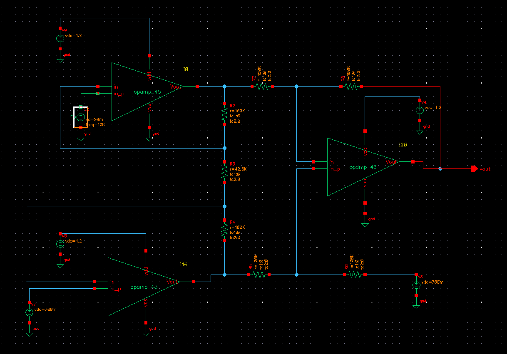

---

# Design Philosophy

Instead of relying on unscaled process parameters, this design mitigates low-node physical limitations (such as severe channel-length modulation and gate-oxide capacitance) through topology-level modifications and conservative sizing:
* **Over-sizing Channel Lengths:** Sizing transistors above the lithographic minimum (200 nm vs. 45 nm) stabilizes the output resistance (r_o), maintaining a robust open-loop gain baseline.
* **Symmetric Differential Routing:** Prioritizes structural symmetry to maximize common-mode noise isolation.
* **Active Reference Biasing:** Restores compressed V_DS headroom through deliberate reference offsets rather than compounding stage gain, keeping devices firmly in the saturation region.

---

# Key Engineering Decisions

### Architectural Tradeoff Analysis

| Component / Node | Selected Approach | Rejected Alternative | Engineering Justification |
| :--- | :--- | :--- | :--- |
| **Process Node Scale** | **45 nm Deep Submicron** | 180 nm Traditional CMOS | **Density & Speed over Headroom:** 45 nm maximizes integration density and operating speed, but compresses the supply rail to 1.2 V and introduces severe short-channel effects. |
| **Sizing Constraint** | **Standardized L = 200 nm** | Lithographic L = 45 nm | **Intrinsic Gain over Speed:** Sizing at 200 nm provides an intentional guardband that preserves an open-loop gain baseline of approx 41.75 dB, preventing complete gain collapse from channel-length modulation. |
| **Reference Bias Topology**| **Injected V_ref = 0.78 V** | Ground Reference (0 V) | **Saturation Preservation over Simplicity:** Tying the difference stage reference to 0 V pulls the common-mode level to approx 0.4 V, driving the NMOS input pair into cutoff. Injecting 0.78 V restores critical V_DS headroom. |

---

# Engineering Highlights

* Comparative technology-scaling study between 180 nm and 45 nm CMOS.
* Quantified the impact of closed-loop loading on CMRR and PSRR.
* Optimized transistor sizing and resistor feedback to recover performance under short-channel effects.

---

# Repository Organization

```

cmos-analog-frontends-cadence/
├── README.md
├── docs/
│   ├── report.pdf
│   ├── circuit_schematics.pdf
│   └── methodology_notes.pdf
├── results/
│   ├── opamp_180nm/
│   │   ├── gain_180.jpg
│   │   └── magnitude180opamp.jpg
│   ├── opamp_45nm/
│   │   ├── gain_opamp.jpg
│   │   ├── tran_opamp.jpg
│   │   ├── opamp_cmrr_only.jpg
│   │   ├── opamp_psrr.jpg
│   │   └── opamp_dc_offset.jpg
│   └── instrumentation_amp_45nm/
│       ├── instr_final_ac.jpg
│       ├── instr_final_gain.jpg
│       ├── instr_final_tran.jpg
│       ├── instrum_cmrr_only_new.jpg
│       └── instrum_psrr.jpg
├── design_screenshots/
│   ├── opamp.png
│   ├── opamp180.png
│   ├── instr_final.png
│   ├── opamp_tester_cmrr.png
│   └── opamp_tester_psrr.png
├── cadence_notes/
│   ├── design_flow.txt
│   └── parameter_sweep_summary.txt
└── LICENSE

```
---

# Process & Device Parameters

The project leverages the **GPDK180 (180 nm CMOS)** and **GPDK045 (45 nm CMOS)** process design kits. To explicitly evaluate the geometric implications of technology migration, the transistor sizing strategies for both nodes are contrasted below. For the 180 nm baseline, a true long-channel guardband (L = 500 nm) was maintained. For the 45 nm submicron node, an intentional over-sizing strategy (L = 200 nm) was enforced to protect the intrinsic gain (A_0 ≈ g_m × r_o) against severe channel-length modulation.

### 1. Legacy 180 nm Baseline Node Sizing (V_DD = 1.8 V)
| Instance | Circuit Function | Device Type | Width (W) | Length (L) | Aspect Ratio (W/L) |
| :--- | :--- | :--- | :---: | :---: | :---: |
| **M1, M2** | Input Differential Pair | NMOS | 3.00 µm | 500 nm | 6.00 |
| **M3, M4** | Active Current Mirror Load | PMOS | 7.00 µm | 500 nm | 14.00 |
| **M5** | Tail Current Source | NMOS | 6.00 µm | 500 nm | 12.00 |
| **M6** | Common-Source Driver Stage | PMOS | 13.07 µm | 500 nm | 173.00 |
| **M7** | Second-Stage Active Load | NMOS | 37.50 µm | 500 nm | 75.00 |
| **M8** | Reference Bias Generator | NMOS | 6.00 µm | 500 nm | 12.00 |


### 2. Deep Submicron 45 nm Node Sizing (V_DD = 1.2 V)
| Instance | Circuit Function | Device Type | Width (W) | Length (L) | Nominal Ratio (W/L) | Effective Ratio ($W_{eff}/L_{eff}$) |
| :--- | :--- | :--- | :---: | :---: | :---: | :---: |
| **M1, M2** | Input Differential Pair | NMOS | 2.20 µm | 200 nm | 11.00 | 10.93 |
| **M3, M4** | Active Current Mirror Load | PMOS | 170 nm | 200 nm | 0.85 | 0.84 |
| **M5** | Tail Current Source | NMOS | 630 nm | 200 nm | 3.15 | 3.12 |
| **M6** | Common-Source Driver Stage | PMOS | 7.04 µm | 200 nm | 35.20 | 35.20 |
| **M7** | Second-Stage Active Load | NMOS | 13.07 µm | 200 nm | 65.35 | 65.35 |
| **M8** | Reference Bias Generator | NMOS | 630 nm | 200 nm | 3.15 | 3.12 |

### Design Note on Literature Reproducibility

The transistor dimensions used in this project follow the geometric baseline reported by **Vasanthi et al.** [1] and subsequently reproduced by **Sharmila Banu et al.** [2].

During replication of the published design, a reproducibility challenge was encountered. Although both papers report an open-loop gain of **95.37 dB** in the text, the published AC gain-phase figures are provided at a resolution that does not permit reliable quantitative extraction or independent verification of the reported values. Consequently, numerical comparison in this work was performed using the published transistor dimensions rather than visual estimation from the figures.

Using the same nominal geometry with contemporary **BSIM4 foundry PDK models** in **Cadence Spectre**, the simulated OTA achieved an open-loop gain of **41.75 dB**. This observed difference is consistent with the effects of realistic deep-submicron device behavior, including reduced intrinsic output resistance resulting from channel-length modulation and threshold-voltage roll-off, which become increasingly significant at the 45 nm technology node.

To support reproducibility, this repository provides the complete simulation methodology, transistor sizing, schematic, testbench configuration, and high-resolution simulation waveforms, allowing readers to independently reproduce and evaluate the reported results.

---

# Software Stack

* **Design Environment:** Cadence Virtuoso IC6.1.8.
* **Simulation Core:** Spectre Circuit Simulator.
* **Analysis Toolsets:** Analog Design Environment (ADE L/XL), Spectre AC, Transient, DC Offset, and Parametric Sweeps.

---

# Repository Contents

This repository contains design schematics, simulation results, and documentation. The original Cadence design database is not included because it depends on proprietary PDKs.

---

# Simulation Methodology

The reported AC, transient, DC, and parametric analyses were performed in Cadence Virtuoso using Spectre with the GPDK045 and GPDK180 process libraries. Representative waveforms and schematic captures are provided in this repository.

---

# Core Design Equations

Detailed analytical design equations used for the two-stage operational amplifier topology sizing, boundary conditions, and open-loop DC gain calculations are formalized below; readers interested primarily in system results may skip directly to the simulation results section

### 1. Miller Compensation Boundary Condition
$$C_c \ge 0.22 \cdot C_L$$

### 2. First-Stage Transconductance Calculation
$$g_{m1} = \text{GBW} \cdot 2\pi C_c$$

### 3. Aspect Ratio Definition for Input Differential Pairs
$$\left(\frac{W}{L}\right)_{1,2} = \frac{g_{m1}^2}{I_{D5}\mu_n C_{ox}}$$

### 4. Aspect Ratio Definition for Active Current Mirror Loads
$$\left(\frac{W}{L}\right)_{3,4} = \frac{2 I_{D3}}{\mu_p C_{ox} (V_{DD} - V_{ICMR(+)} - |V_{tp}|)^2}$$

### 5. Tail Current Bias Device Conditioning
$$I_{D5} = \frac{1}{2} \mu_n C_{ox} \left(\frac{W}{L}\right)_5 V_{DSAT}^2$$

### 6. Active Load Stage Transconductance
$$g_{m4} = \sqrt{2 I_{D4} \mu_p C_{ox} \left(\frac{W}{L}\right)_4}$$

### 7. Common-Source Driver Stage Sizing Constraints
$$\left(\frac{W}{L}\right)_6 = \frac{g_{m6}}{g_{m4}} \left(\frac{W}{L}\right)_4$$

### 8. Second-Stage Active Load Sink Sizing Constraints
$$\left(\frac{W}{L}\right)_7 = \frac{I_{D7}}{I_{D5}} \left(\frac{W}{L}\right)_5$$

### 9. Total System Open-Loop Small-Signal DC Voltage Gain
$$A_v = \left( \frac{g_{m1}}{g_{ds2} + g_{ds4}} \right) \left( \frac{g_{m6}}{g_{ds6} + g_{ds7}} \right)$$

### 10. Three-Op-Amp Instrumentation Amplifier Closed-Loop Voltage Gain
$$A_{V,\text{closed}} = \left(1 + \frac{R_2 + R_4}{R_3}\right) \left(\frac{R_8}{R_7}\right)$$

---

# Limitations

* **Headroom Compression Bounded by Rail Limits:** The 1.2V supply limits large-signal output swings, risking device saturation loss if excursions exceed compliance boundaries.
* **Short-Channel Output Resistance Attenuation:** The structural $L = 200\text{nm}$ limit exhibits severe channel-length modulation, restricting open-loop DC gain to a hard baseline ceiling of $\approx41.75\text{ dB}$.
* **Sensitivity to High-Frequency Parasitic Capacitances:** High integration density scales up drain parasitic junctions, which can compromise phase margin stability boundaries at high frequencies if layout parameters diverge from schematic targets.

---

## Non-Ideal Effects & Design Trade-offs

* **Common-Mode Input Cutoff:** If the input common-mode voltage drops below 0.4 V, the internal NMOS differential pair drops out of saturation ($V_{DS} < V_{GS} - V_{th}$) and enters the triode region, resulting in complete system gain attenuation. This vulnerability is neutralized by maintaining the custom injected $V_{ref} = 0.78\text{ V}$ rail.
* **Finite Open-Loop Loading & Tracking Error:** The ideal textbook equation predicts a system gain of **15.13 dB** ($5.71\text{ V/V}$), while first-order finite gain equations predict **14.73 dB**. However, the actual simulated system gain drops to **13.92 dB**. 
 This remaining $0.81\text{ dB}$ delta is driven by **resistive loading**: the unbuffered 45 nm op-amp macros feature a high intrinsic output resistance ($r_o$) that is actively shunted by the physical resistor network. This lowers the effective operational open-loop gain ($A_{OL}$) and introduces a predictable tracking loss governed by the target architectures:
  $$A_{V,\text{ideal}} = \left(1 + \frac{R_2 + R_4}{R_3}\right) \cdot \frac{R_8}{R_7} = 1 + \frac{2 \cdot 100\text{ k}\Omega}{42.5\text{ k}\Omega} = 5.71\text{ (15.13 dB)}$$
  $$A_{V,\text{actual}} \approx \frac{A_{V,\text{ideal}}}{1 + \frac{A_{V,\text{ideal}}}{A_{OL}}}$$
* **PSRR Degradation due to Feedback Loading:** Under standalone open-loop testing with uncoupled ideal bias networks, the op-amp yields an excellent isolated PSRR+ of 139.70 dB. However, integrating the physical resistive feedback network introduces low-impedance AC leakage paths. Power rail ripples directly modulate the feedback network, causing system-level PSRR+ degradation to 25.14 dB.
* **High-Frequency Parasitic Sensitivity:** The high layout density of the 45 nm node scales up drain parasitic junctions. If layout routing parameters diverge from schematic targets, these parasitics risk shifting secondary high-frequency poles, compromising the 64.8° phase margin.
  
---

# Future Improvements

* Layout migration using common-centroid matching structures to mitigate thermal and process gradients.
* Parasitic Extraction (PEX) post-layout simulation loops to re-verify phase margin bounds.
* Monte Carlo analysis evaluating process parameter mismatch and threshold tracking variations.

---

# Results

The performance metrics verified across both technology nodes and system boundaries are compiled below:

| Parameter | 45 nm Two-Stage Op-Amp | 45 nm Instrumentation Amp | 180 nm Reference Block |
| :--- | :---: | :---: | :---: |
| **Topology Architecture** | Open Loop | Closed Loop (A_v ≈ 5) | Open Loop |
| **DC Open-Loop Gain** | 41.746 dB | 13.92 dB (Closed Loop) | 47.50 dB¹ |
| **Gain-Bandwidth Product (GBW)**| 50.00 MHz | — | 30.00 MHz |
| **3dB Bandwidth (f_-3dB)** | 410.00 kHz | 10.00 MHz | 120.00 kHz¹ |
| **Phase Margin (PM)** | 64.8° | — | 62.1°¹ |
| **CMRR (Low Frequency)** | 28.93 dB | 76.87 dB | — |
| **PSRR+ (Low Frequency)** | 139.70 dB | 25.14 dB (Loaded) | — |
| **Systematic Input Offset** | 6.15 mV | —² | — |
| **Supply Voltage (V_DD)** | 1.2 V | 1.2 V | 1.8 V |

---
¹ *Note: Extracted explicitly from the 180nm open-loop AC characterization data (`gain_180.jpg`, `magnitude180opamp.jpg`).*
² *Note: Attenuated below detectable measurement thresholds via closed-loop feedback matrix normalization.*

---

# Key Takeaways

- Demonstrated the impact of technology scaling from 180 nm to 45 nm CMOS.
- Quantified the trade-offs between intrinsic gain, bandwidth, CMRR, and PSRR.
- Showed that intentional channel-length over-sizing and optimized feedback networks recover precision despite short-channel effects.
- Verified the effectiveness of the three-op-amp instrumentation amplifier architecture for precision analog front-end applications.

---

## Documentation & Resources

For detailed physical derivations, setup steps, and automated parameter tracking data, please refer to the primary project logs:

* 📄 **[Full Project Report (PDF)](docs/report.pdf):** Detailed documentation of design choices, mathematical derivations, and multi-node analysis.
* 📊 **[Parameter Sweep Summary](cadence_notes/parameter_sweep_summary.txt):** Raw automated aspect ratio sweep data used to stabilize transconductance paths and minimize layout sensitivity.
* ⚙️ **[Cadence Design Flow Notes](cadence_notes/design_flow.txt):** The master simulation workflow mapping log and graphical audit trail linking all 17 verification testbenches directly to their workspace output plots.

*Note: This repository contains design schematics, simulation results, and extracted documentation. The original Cadence design database is not included as it depends on proprietary GPDK libraries.*

---

## Simulation Workflow & Graphical Demonstration

The following cellviews, verification testbenches, and macro behaviors follow the structural tracking map documented inside `design_flow.txt`:

### 1. Cadence Schematic Cellviews & Design Screenshots
* **Core 45 nm Operational Amplifier Cell:**
  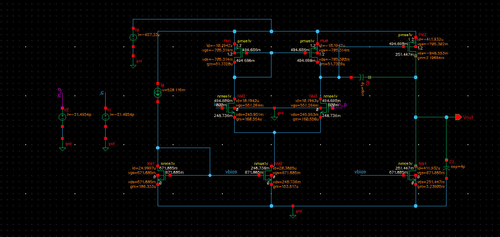
* **Legacy 180 nm Reference Amplifier Cell:**
  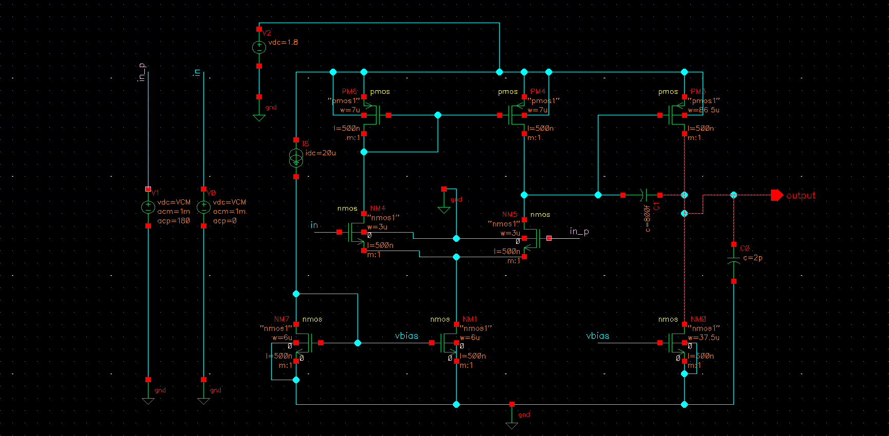
* **High-Isolation 45 nm Instrumentation Amplifier:**
  
* **CMRR Evaluation Test Setup Schematic Configuration:**
  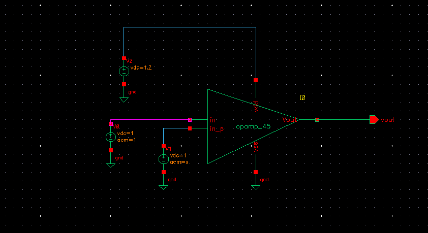
* **PSRR+ Evaluation Test Setup Schematic Configuration:**
  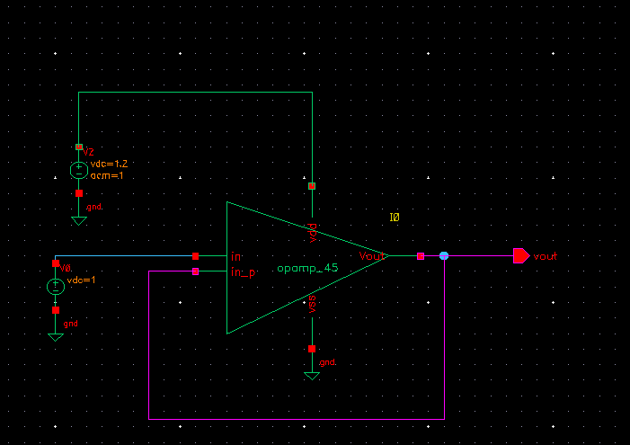


### 2. 180 nm Tracking Baseline Analyses
* **Gain & Phase Sweep Response Profiles:**
  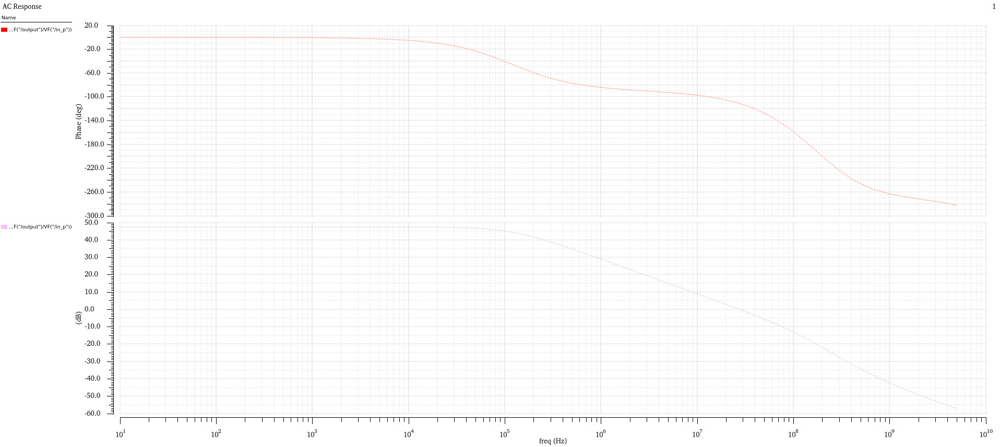
* **Isolated Magnitude Band Plateau:**
  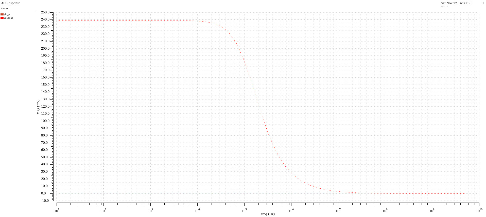

### 3. 45 nm Block-Level Optimization Analyses
* **Bode Plots Validating Phase Margin = 64.8°:**
  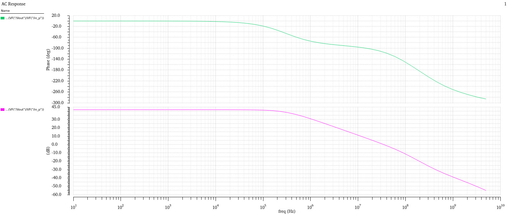
* **Large-Signal Transient Tracking Response:**
  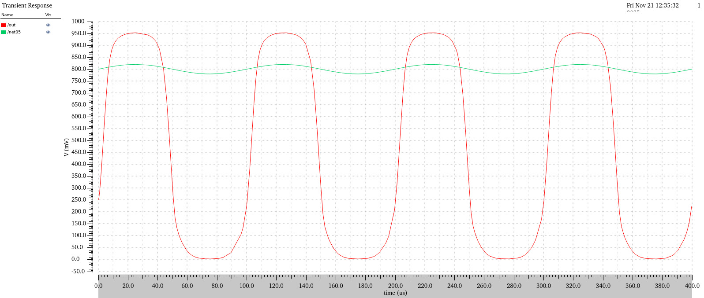
* **Isolated Op-Amp Rejection Sweep:**
  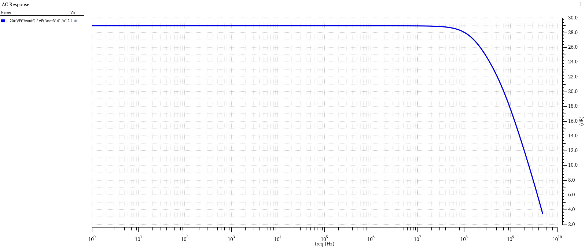
* **Isolated Power Supply Rejection Sweep:**
  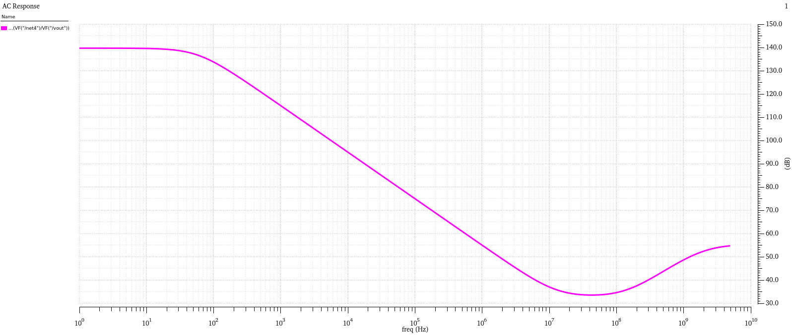
* **DC Analysis Showing 6.15 mV Systematic Offset:**
  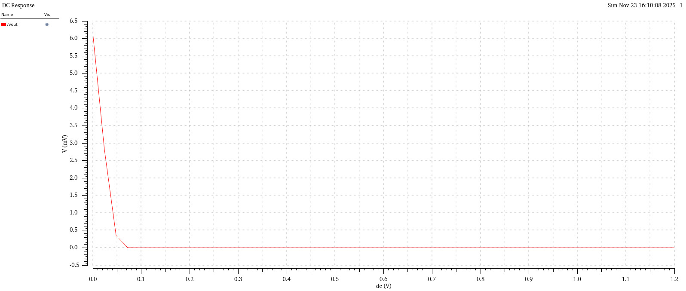

### 4. System-Level 45 nm Instrumentation Amplifier Characterization
* **System AC Transfer Gain in dB:**
  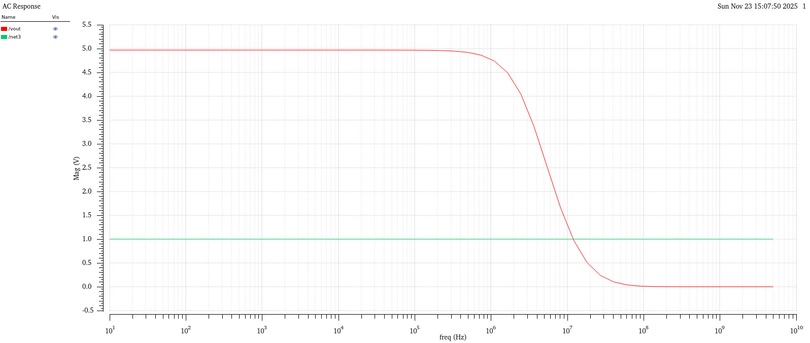
* **Linear Magnitude Mapping Confirming Gain ≈ 5:**
  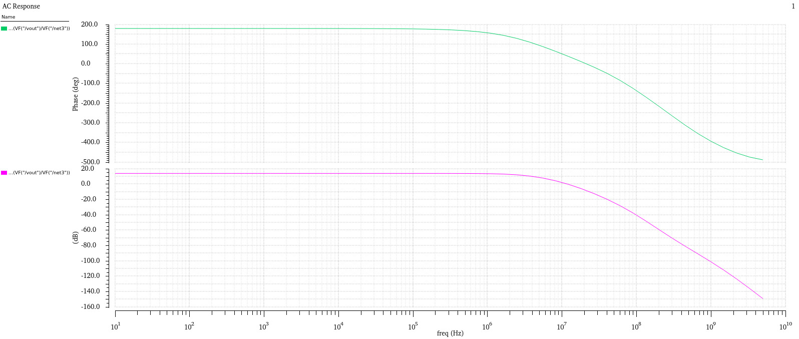
* **System Closed-Loop Transient Response:**
  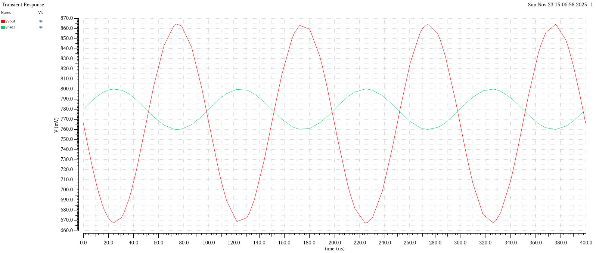
* **System Enhanced CMRR Spectrum:**
  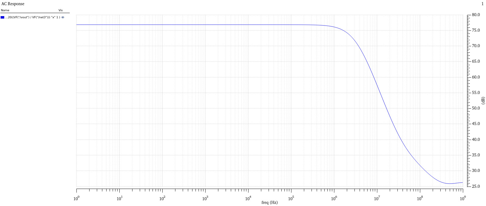
* **System Loaded Network PSRR Spectrum:**
  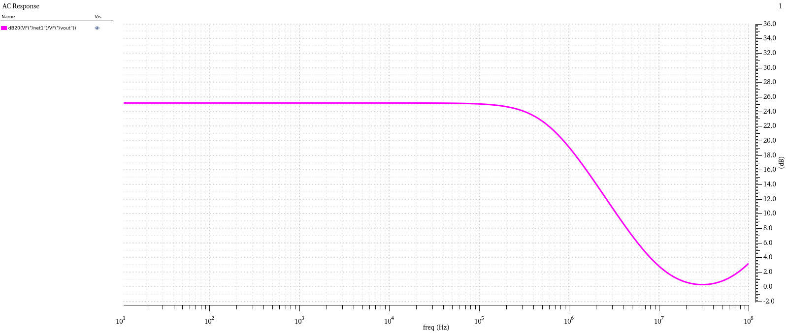

---

## References

[1] R. Vasanthi, A. Suganthi, and P. Subathra, "Design and Analysis of a 1.2V OTA-Based Active Filters in 45nm CMOS Technology," *International Journal of Scientific & Engineering Research (IJSER)*, vol. 5, no. 5, pp. 1602–1606, May 2014.

[2] S. Sharmila Banu, H. K. Lingam, C. Mekala, and M. Maddileti, "Design and Analysis of a 1.2V OTA-Based Active Filters in 45nm CMOS Technology," *Proceedings of the 3rd International Conference on Device Intelligence, Computing and Communication Technologies (DICCT)*, 2025. DOI: 10.1109/DICCT64131.2025.10986514. [[IEEE Xplore]](https://ieeexplore.ieee.org/document/10986514) 

---

# License

MIT License
